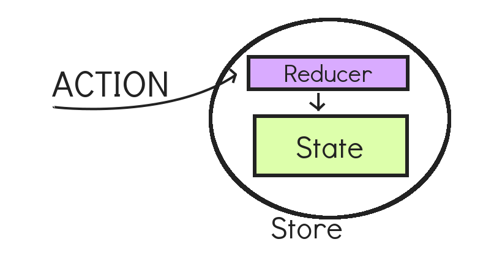
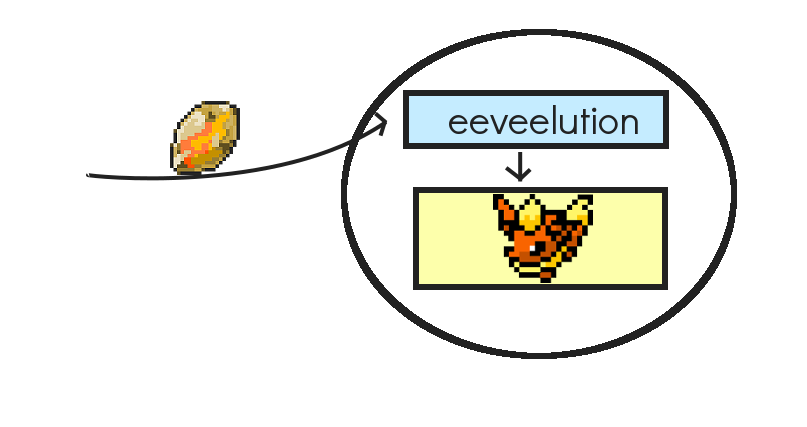

# Eeveelution

Redux DEMO from my talk about Funcional JS at [Front in Acaraju](http://frontinaracaju.com.br/).

[Slides here {pt-BR}](http://marinalimeira.github.io/talk-funcional-js).

## Redux

If your store is a Pokemon, and it is an Eevee, when you send an action of type `FIRE_STONE`, it will envolve, like this:

This repo is an example of how you could envolve your Eevee using Redux.

`setup` branch is the sketch that I used at the live coding.

*Thanks [@halan](http://github.com/halan/) for your help!*
